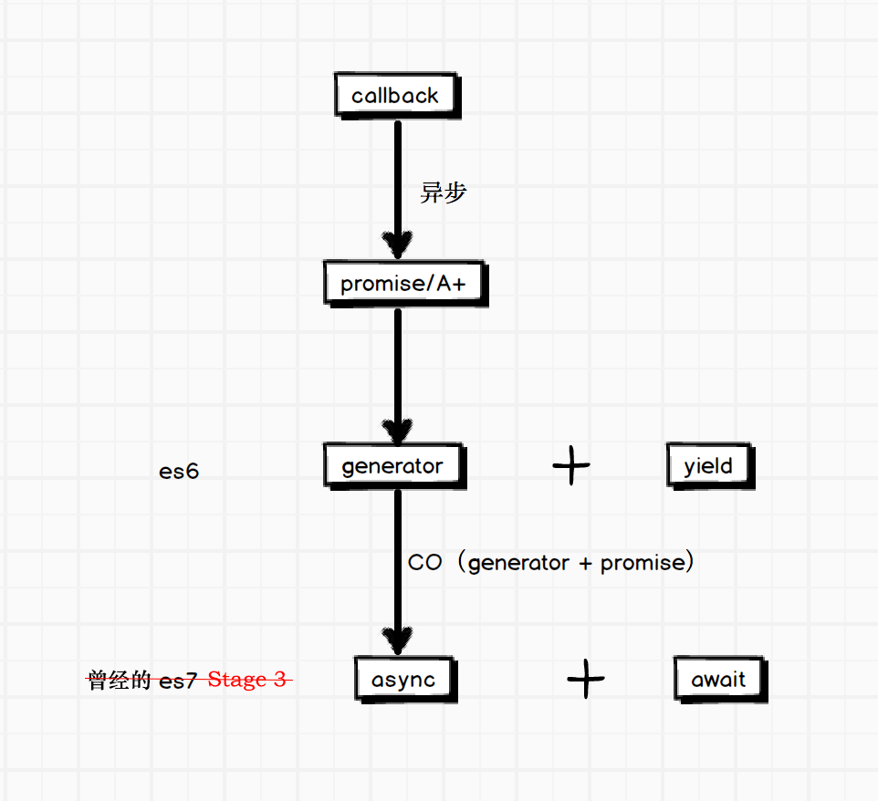

# asynchronous-flow-control

InfoQ 前端之巅分享专业《深入浅出js（Node.js）异步流程控制》

## 摘要

目前在js流程控制领域越来越乱，各种派系。。。比如promise，generator，async函数，各种混战，在百花齐放的今天，作为前端或Node.js沾边工程师或全栈工程师，你知道该学哪种么？

- 从下一代测试框架ava说起
- 流程控制发展的前世今生概览
- 从co引出的血案，到yieldable 5种，到aysnc函数，聊聊同步的流程控制
- 最后推导一下学习重点、未来趋势

## 个人介绍

i5ting（江湖人称狼叔），空弦科技 CTO，StuQ 明星讲师，开源项目 Moajs 作者，Node.js 技术布道者，即将出版《更了不起的 Node 4：将下一代 Web 框架 Koa 进行到底》

曾就职在新浪、网秦，曾做过前端、后端、数据分析、移动端负责人、做过首席架构师、技术总监，全栈技术实践者，目前主要关注技术架构和团队梯队建设方向。


# 流程控制

js流程控制的演进过程，分以下5部分

1. 同步代码
1. 异步JavaScript: callbackhell
1. Promise/a+
1. 生成器Generators/yield
1. Async函数/await（以前说是es7 stage-3）



看起来挺简单的，作为*js[沾边]工程师的各位自测一下，当前是哪个阶段？


> > > > 这次分享的主题《深入浅出js（Node.js）异步流程控制》，为什么要从下一代测试框架ava开始呢？


i5ting：看似无关，但实际上测试框架才是对流程控制提供最全的最简洁的集成的，如果通用性的测试框架都解决不好流程控制问题，那么，这样的东西不用也罢。
[AVA](https://github.com/avajs/ava)是面向未来的测试运行器，简单的说ava是mocha的替代品，对es6语法支持更好，对aysnc/await有支持，执行效率更高，使用io并发，就必须保证测试的原子性，语义上更简单，集众家之长。

举个例子

```
test('synchronization', t => {

})
```

是同步测试写法，如果里面有异步代码，你的测试就不正确了。

解决办法非常简单

```
test.cb('asynchronization', t => {

})
```

多了一个`cb`就解决了callball异步问题，是不是非常简单？

```
test.cb('error-first callback with setTimeout', t => {
    setTimeout(() => {
      t.pass();
      t.end();
    }, 2000);
});

```

> > > > 总结
在浏览器端，目前只有 Firefox 27 和 Chrome 39 以上的版本才支持 Generator，Node.js里还好，0.12之后就可以，而Async函数[Chrome 52. v8 5.1已经支持async函数](https://github.com/nodejs/CTC/issues/7)，更加蛋疼。。。那么，我们就不学了么？ 


看一下我们要聊聊几种模式？

- 1）同步
- 2）callback
- 3）promise
- 4）generator
- 5）async function


- 从下一代测试框架ava开始
- co引出的血案
  - generator/yield
  - co源码解析
  - convert or compose
- yieldable 5种
- async/await
- 推导出学习重点

涵盖

- callback vs hell
- Node.js的error-first和EventEmitter
- thunk
- promise/a+
- generator/yield
- async/await
- 异常处理
- 各种xxx-fy

# 联系我

